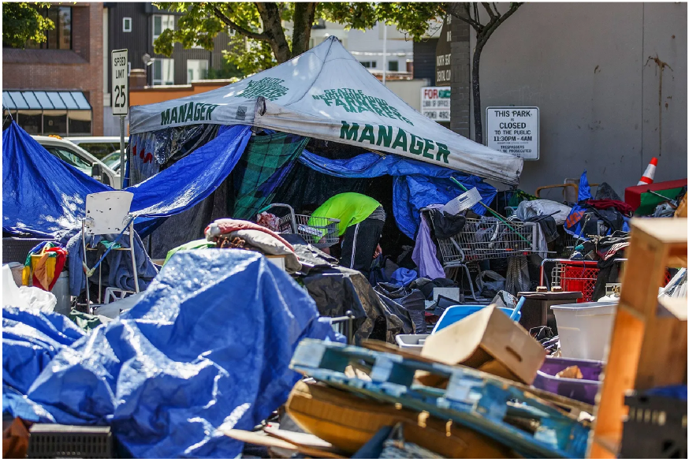

#### Group 3 Section AG, By: Brennon Lee, Trevor Wong, and Rayna Ojas

### Summary

Our project aims to dive deeper into homelessness in order to try to find patterns on 
why some states have an increasing rate of homelessness while others have a decreasing rate.
We create multiple interactive charts in order to better visualize the sheer amount of data 
that we found.

### Problem

Shelter and housing is something that may seem basic. You probably are fortunate enough to 
have a roof over your head and a bed to go to at the end of the day. However, across America, 
there are over half a million people who aren't as fortunate and aren't able to have a 
roof over their head or a bed to sleep in. This causes many problems and challenges not only for 
those that are homeless, but also those around them. As shown in the picture above, homelessness
creates a space in many public areas that are dirty and unsanitary, which imapcts everyone in that
area. While you may think that someone being homeless is their own fault or their own choice, 
more often than not this isn't the case. There are many external reasons why someone may be facing 
homelessness including the lack of structural supports for those experiencing poverty, job loss that
is out of their control, and inadequate help and discharge from people that are leaving hospitals, 
correctional, or mental health facilities.

### Our Questions

The research questions we will be exploring are: How does homelessness vary between states in America and why? 
What factors may contribute to the volume of homelessness in a city? and In Seattle, how has the homelessness issue 
changed over the years? Have services offered over the years led to a change in the numbers? We address these 
questions in the tabs above. Please click on a tab to learn more about each topic.

### Our Aims and Data

For this project, we aim to investigate the homelessness rates and shelter rates across multiple
areas in order to determine what factors may be leading to homelessness. We utilize five main datasets
to pull data from regarding daily homelessness shelter counts, homelessness counts per state in 2020,
homelessness change in percentage from 2020 to previous years, homelessness counts in major cities in 
2018, and the homelessness representation ratio for major cities in 2018. These data sets are all taken
from government websites so they are trustworthy and full of valuable information. We use this data to 
dive deeper into homelessness. Exploring this data is crucial to determine patterns between homelessness 
and other factors that may be causing homelessness.

### Key Findings
##### See summary page for more in depth information

We found that the states with the highest homelessness are also the states with highest general population
or have a very large urbanized city like Los Angeles or New York. 

We also found that overall, homelessenss has been on the rise. At the start of the 10 years, homelessness was decreasing at a steady rate until halting around 2016 and remaining fairly constant over the next 2 years. However, following 2018 homelessness has been rising just as consistently as it fell in prior years. 

