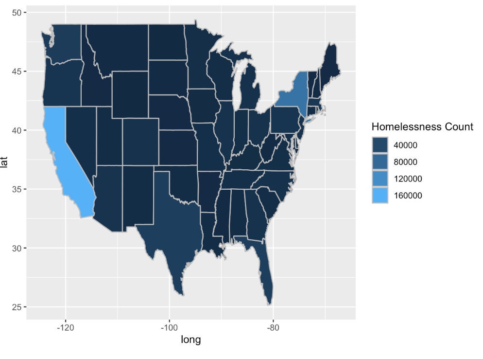
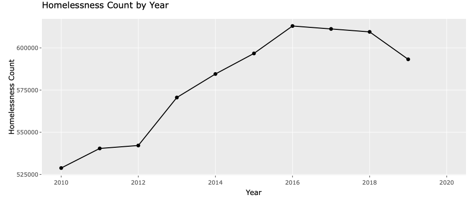

Throughout the project, our group was able to explore the U.S. homelessness data and discover trends that spanned across the nation and across years. The valuable findings we made were incorporated into various graphs that helped display the data more clearly as opposed to a table of figures and locations. Among our findings, there were 3 main takeaways we parted with by the end of the project.

### Trends of Homelessness Populations Across the Nation (Choropleth Map)

The first research question we sought out was how does homelessness vary across states in the U.S. -- and we were able to discover this answer through a map of the nation. This map of the U.S. highlights the states where homelessness is more prominent and its clear to see that California is currently the state with the greatest number of people. This graph is taken a step further in the interactive tab "Nationwide Homelessness" as it provides a parameter of homelessness population that eliminates outliers such as California in order to view the data in greater detail among states with similar homelessness counts.

Viewing this map helps us analyze which areas in the nation are in greater need of help and it also provides an idea of how geography or population density of a state can lead to a greater or lesser homelessness count.

### Distribution of Status Among Homelessness Shelters (Pie Chart)

The second research question we sought out was what factors contribute to the volume of homelessness in a city? Although the question was not explicitly answered, we managed to analyze one of the factors that have relevance to the volume of homelessness and that is the distribution of status each individual in homelessness shelters hold. It is clear that over half of those in homeless shelters are individuals in adult families with children, while the rest of the pie chart consists of single adults or a slimmer percentage of individuals in purely adult families.

Understanding this helps push focus on the groups more likely at risk of homelessness and assuming that it is something that cannot be avoided, it is important to make efforts to support those groups. As these are families with children, they have various burdens to carry and needs to fulfill, so lending a hand to these families would be in the nations best interests.

### Trend of Homelessness Across the Years (Line Chart)

The last research question we sought was how has the homelessness issue changed over the years? We solved this question by analyzing the total number of homeless across years 2010-2020. With a 10 year window, we hoped to find a fitting explanation to the question and we were not disappointed with the result. This graph is refined further to analyze each state individually in the "Homelessness Trends" tab. 

At the start of the 10 years, homelessness was decreasing at a steady rate until halting around 2016 and remaining fairly constant over the next 2 years. However, following 2018 homelessness has been rising just as consistantly as it fell in prior years. With this information, we can compare the numbers to events or policies that may have occurred or been enforced in those years which either led to an increase or decrease to the homeless population.

### Closing Thoughts
In conclusion, our analysis was able to answer each of our questions in a manner that helped convey easier to understand information to viewers. By creating visualizations, we were able to get a better idea of the data we were tackling, then we refined those visualizations further by developing interactive versions of it. Overall, we were able to develop our proficiency in R and Shiny while also educating ourselves with the current status of the U.S. homelessness issue that remains ongoing.
